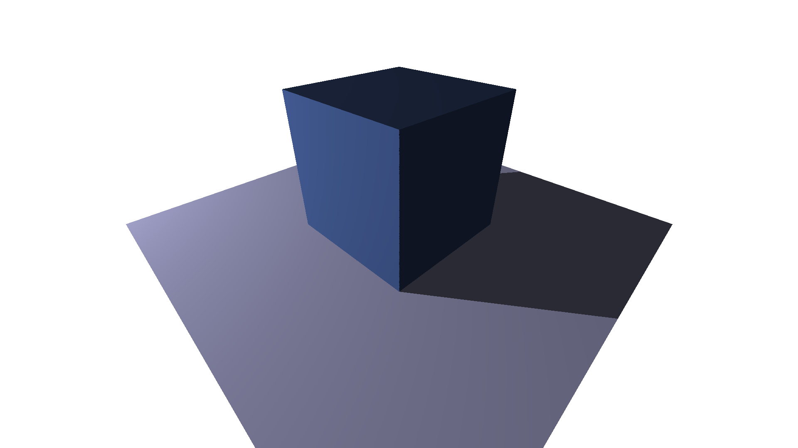

# Raytracer

This is a small project of a simple raytracing engine implemented with C and C++. This project is being done mostly as I want to learn to leverage capabilities provided by compiles and hardware, in particular the goals are:
1. Efficiently apply low-level vector optimizations (accessed via vector intrinsics)
2. Make the code multithreaded, rendering chunks of pixmaps in different threads
3. Possibly in future, make a totally separate GPU implementation with CUDA.

So far there's a scalar version entirely implemented. The core code which makes the actual raytracing (evaluates intersections of rays with faces and calculates shades and exposure by light) is written in C language (rtcore/ folder), on C++ side there're basically color evaluation and saving pixmaps in files (render/ folder).

### JSON format for specifying shapes

Currently this raytracing engine can load faces (triangular polygons) and configuration of lights from JSON files. An example file can be found at test/sample.json, and its rendered picture is test_sample.png (rendered by test/test_sample.cpp). *TODO: Write more about it*

### Agenda:

1. Figure out with profilers most time-consuming parts of the code and the ways how they may be optimized with vector intrinsics. However in the raytracing code there're too many places with boolean checks involved, what makes efficient usage of vector intrinsics hindered and doubtful.
2. Make the code multithreaded; presumably the easiest part of this work, as STL provides most straightforward interface for running threads (the main reason why "frontend" part of this engine is implemented with C++; otherwise I would have had to use pthreads directly, what's much uglier.)